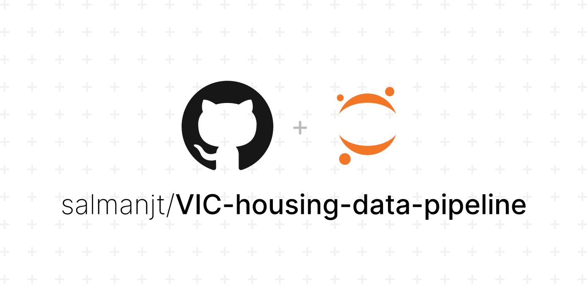

# Victorian Housing Data Integration and Transformation for Predictive Analysis



## Project Description

This project focuses on integrating and transforming diverse datasets related to housing in Victoria, Australia. The primary objective is to create a unified dataset by merging data from multiple sources such as XML, JSON, shapefiles, GTFS data, PDFs and web-scraped information. This unified dataset facilitates comprehensive data analysis, trend identification and machine learning applications in the real estate domain.

## Key Steps Involved

### Data Loading

Importing data from XML and JSON property files, shapefiles for suburb boundaries, GTFS public transport data, PDFs for LGA-to-suburb mappings, and web-scraped housing data.

### Data Integration

-   **Property Data:** Merging XML and JSON property information into a single DataFrame, ensuring consistency and handling duplicates.
-   **Geospatial Mapping:** Mapping properties to suburbs and LGAs using geographic coordinates through spatial joins.
-   **Transport Accessibility:** Calculating distances to nearest train stations and estimating travel times to Melbourne Central using GTFS data.
-   **Web Scraping:** Extracting additional housing data, such as median house prices, number of houses/units and demographics from `house.speakingsame.com`.

### Data Transformation

-   **Data Cleaning:** Addressing missing values, correcting data types and standardising formats across the integrated dataset.
-   **Feature Engineering:** Creating new variables such as travel time to Melbourne Central (`travel_min_to_MC`) and direct journey flags (`direct_journey_flag`).
-   **Normalization and Scaling:** Applying data transformation techniques such as z-score standardisation, min-max scaling, and log transformations to prepare the dataset for modeling.

### Model Evaluation

Assessing the impact of different data transformation techniques on linear regression models, using performance metrics like Root Mean Square Error (RMSE) and R-squared (R²).

Overall, this project highlights a robust approach to turning heterogeneous and unstructured data into a cohesive dataset suitable for downstream analysis, providing a strong foundation for real estate market analysis and urban planning efforts.

## Technologies Used

-   Python (Pandas, NumPy)
-   Geospatial Analysis (GeoPandas, Shapely, Folium)
-   Data Visualisation (Matplotlib, Seaborn)
-   Web Scraping (Requests, BeautifulSoup)
-   PDF Processing (PDFMiner)

## Project Tree

```
📦 VIC-housing-data-pipeline
├─ LICENSE
├─ README.md
├─ data
│  ├─ input
│  │  ├─ Lga_to_suburb.pdf
│  │  ├─ Vic_GTFS_data
│  │  │  ├─ .DS_Store
│  │  │  └─ metropolitan
│  │  │     ├─ agency.txt
│  │  │     ├─ calendar.txt
│  │  │     ├─ calendar_dates.txt
│  │  │     ├─ routes.txt
│  │  │     ├─ shapes.txt
│  │  │     ├─ stop_times.txt
│  │  │     ├─ stops.txt
│  │  │     └─ trips.txt
│  │  ├─ Vic_suburb_boundary
│  │  │  ├─ VIC_LOCALITY_POLYGON_shp.dbf
│  │  │  ├─ VIC_LOCALITY_POLYGON_shp.prj
│  │  │  ├─ VIC_LOCALITY_POLYGON_shp.shp
│  │  │  └─ VIC_LOCALITY_POLYGON_shp.shx
│  │  ├─ properties.json
│  │  └─ properties.xml
│  ├─ output
│  │  ├─ properties_solution.csv
│  │  └─ scraped_data.csv
│  └─ sample
│     └─ sample_output.csv
└─ notebooks
   ├─ 01-housing-data-pipeline.ipynb
   └─ exports
      └─ 01-housing-data-pipeline.py
```

## Installation

1. Clone the repository:

    ```bash
    git clone https://github.com/salmanjt/VIC-housing-data-pipeline.git
    cd VIC-housing-data-pipeline
    ```

2. Install required dependencies:

    ```bash
    pip install -r requirements.txt
    ```

## Data Sources

This project uses several publicly available datasets:

-   Property data (XML, JSON) from project specifications
-   Geographic boundaries (shapefiles) from Victorian Government Data Directory
-   Public transport data (GTFS) from Public Transport Victoria
-   Web-scraped housing statistics from `house.speakingsame.com`

## Future Improvements

-   **Automated Testing:** Implement automated tests for data extraction and transformation processes to ensure robustness and reliability.
-   **Advanced Modeling:** Explore advanced machine learning models, such as ensemble methods or neural networks, to enhance predictive performance.
-   **Interactive Visualisation:** Integrate interactive visualisation to better understand spatial relationships and housing trends.
-   **Data Updates:** Establish routines for regularly updating the dataset to reflect changes in property listings, transport schedules and housing market conditions.

## License

This project is licensed under the MIT License - see the [LICENSE](https://github.com/salmanjt/VIC-housing-data-pipeline/blob/main/LICENSE) file for details.
